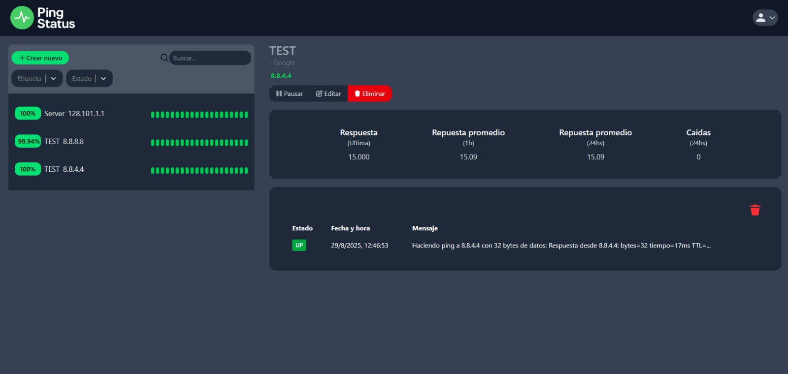
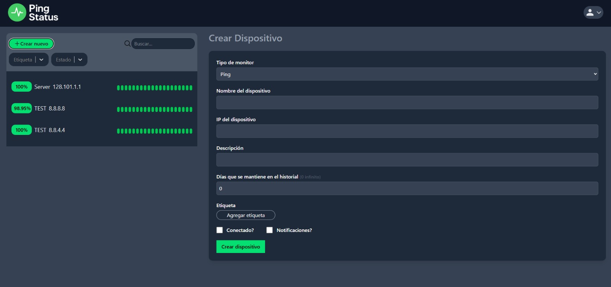
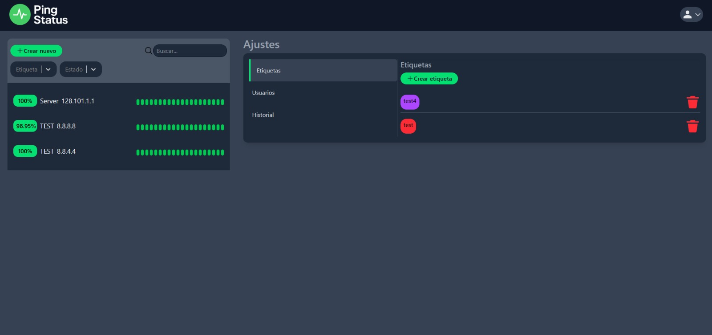

# Ping Status

**Ping Status** es un sistema web de monitoreo de dispositivos.  
Permite registrar dispositivos y realizar un **ping constante a su IP** para verificar su disponibilidad.  
En caso de que un dispositivo deje de responder, el sistema enviará una **alerta automática a Telegram** con los detalles del evento.

---

## 🚀 Tecnologías utilizadas

### Backend

- **Node.js**
- **Express**
- **MongoDB**
- **Socket.IO**

### Frontend

- **React**
- **TailwindCSS**

---

## 📦 Librerías

### Backend

- [ping](https://www.npmjs.com/package/ping)
- [bcrypt](https://www.npmjs.com/package/bcrypt)
- [cookie-parser](https://www.npmjs.com/package/cookie-parser)
- [cors](https://www.npmjs.com/package/cors)
- [dotenv](https://www.npmjs.com/package/dotenv)
- [jsonwebtoken](https://www.npmjs.com/package/jsonwebtoken)
- [mongoose](https://www.npmjs.com/package/mongoose)
- [socket.io](https://www.npmjs.com/package/socket.io)
- [telegraf](https://www.npmjs.com/package/telegraf)
- [express](https://www.npmjs.com/package/express)

### Frontend

- [axios](https://www.npmjs.com/package/axios)
- [socket.io-client](https://www.npmjs.com/package/socket.io-client)
- [react-select](https://www.npmjs.com/package/react-select)
- [tailwind-scrollbar](https://www.npmjs.com/package/tailwind-scrollbar)

---

## ⚙️ Funcionalidades principales

- Registro de dispositivos a monitorear.
- Registro del historial de caidas y subidas del dispositivo.
- Monitoreo en tiempo real mediante **ping**.
- Notificaciones automáticas vía **Telegram**.
- Interfaz web intuitiva con **React + TailwindCSS**.
- Comunicación en tiempo real con **Socket.IO**.
- Manejo de usuarios con JWT.

---

## 📸 Capturas





---

## 🔧 Instalación y uso

1. Clonar el repositorio:

   ```bash
   git clone https://github.com/usuario/ping-status.git
   cd ping-status
   ```

2. Instalar dependencias en el backend:

   ```bash
   cd ./backend
   npm install
   ```

3. Instalar dependencias en el frontend:

   ```bash
   cd ./frontend
   npm install
   ```

4. Configurar variables de entorno en el backend (`/backend/src/config/.env`):

   ```
   TOKEN_TELEGRAM=
   GROUP_CHAT_ID=-
   SECRET_JWT=
   DB_URI=
   SECRET_COOKIE=
   NODE_ENV=  (production en caso de poner en producción)
   ```

5. Configurar variables de entorno en el frontend (`/frontend/.env`):

   ```
   VITE_API_URL= ("URL DEL SERVIDOR BACKEND")
   ```

6. Ejecutar el backend:

   ```bash
   npm run dev
   ```

7. Ejecutar el frontend:

   ```bash
   npm run dev
   ```

8. Crear un bot en telegram con BotFather y agregar el id del bot y id del chat al .env (en caso de querer recibir notificaciones via telegram)

9. Se crea automaticamente un usuario "superadmin", user:admin clave:123, desde dentro de la app podra cambiar su clave.

---

## Acerca del proyecto

El proyecto Ping Status fue desarrollado en su totalidad por Anibal Eduardo Paini, tomando como referencia Uptime Kuma.

---

## 📄 Licencia

Este proyecto está licenciado bajo la **Creative Commons Attribution-NonCommercial 4.0 International (CC BY-NC 4.0)**.

Puedes:

- Compartir: copiar y redistribuir el material en cualquier medio o formato.
- Adaptar: remezclar, transformar y crear a partir del material.

Bajo las siguientes condiciones:

- **Atribución**: Debes dar crédito adecuado, proporcionar un enlace a la licencia e indicar si se han realizado cambios.
- **No Comercial**: No puedes utilizar el material con fines comerciales.

🔗 Más información: [https://creativecommons.org/licenses/by-nc/4.0/](https://creativecommons.org/licenses/by-nc/4.0/)

---

**Ping Status** desarrollado por _Anibal Eduardo Paini_.
